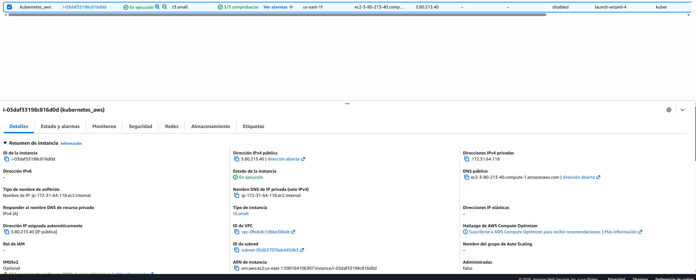
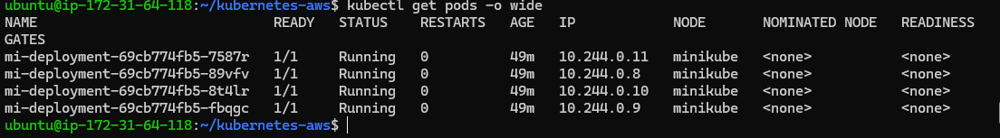
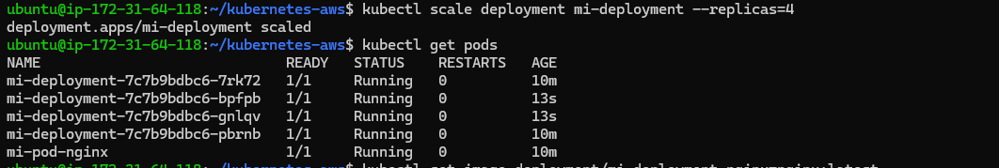
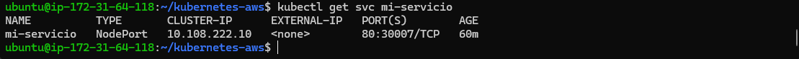
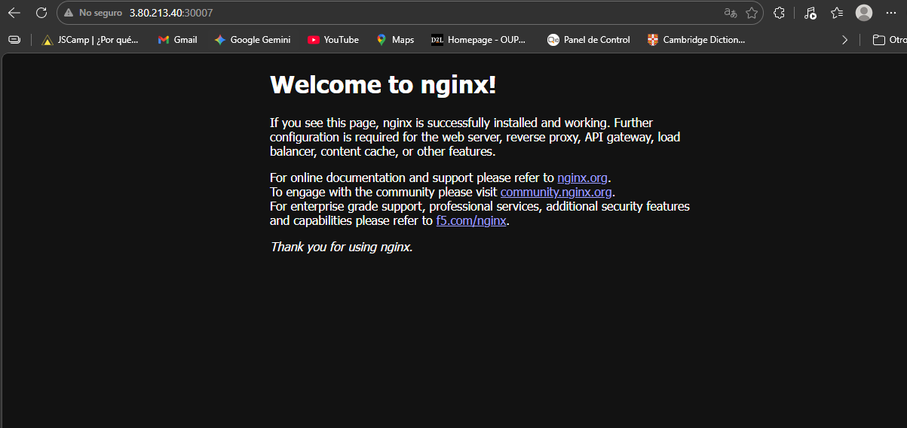

# Laboratorio: Despliegue de Aplicaciones con Kubernetes en AWS EC2
Este repositorio contiene la resolución del laboratorio de orquestación utilizando una instancia AWS EC2 (Ubuntu), Minikube con driver de Docker y manifiestos YAML.

## 1. Objetos de Kubernetes Utilizados

* **Pod (`mi-pod-nginx`):** Unidad mínima de ejecución que contiene el contenedor de Nginx.
* **Deployment (`mi-deployment`):** Orquestador que garantiza la alta disponibilidad. Se configuró inicialmente con 2 réplicas y luego se escaló a 4.
* **Service (`mi-servicio`):** Recurso de tipo `NodePort` que expone la aplicación en el puerto **30007** para permitir el acceso externo.
* **ConfigMap (`mi-config`):** Almacena variables de entorno no sensibles (*"Hola desde Kubernetes en AWS"*).
* **Secret (`mi-secret`):** Almacena información sensible (*password*) de forma codificada en Base64.

## 2. Comandos Principales Ejecutados
### Preparación y Despliegue
```bash
minikube start --driver=docker
kubectl apply -f pod-nginx.yaml
kubectl apply -f deployment.yaml
kubectl apply -f service.yaml
Gestión y Seguridad
Bash
kubectl create configmap mi-config --from-literal=mensaje="..."
kubectl create secret generic mi-secret --from-literal=password="..."
kubectl scale deployment mi-deployment --replicas=4
kubectl set image deployment/mi-deployment nginx=nginx:latest
```
##  3. Problemas Encontrados y Soluciones

Durante el despliegue en el entorno de AWS EC2, se identificaron y resolvieron los siguientes retos técnicos:

> [!IMPORTANT]
> **Problema 1: Conexión denegada en `localhost`**
> * **Contexto:** Al intentar realizar un `curl http://localhost:30007` desde la terminal de la instancia EC2, la conexión fue rechazada.
> * **Análisis:** Al ejecutar Minikube con el driver de `docker`, el clúster de Kubernetes corre dentro de una red aislada (un contenedor Docker). Por lo tanto, el `localhost` de la instancia no ve directamente los puertos del clúster.
> * **Solución:** Se utilizó el comando `minikube ip` para identificar la dirección del nodo (en este caso `192.168.49.2`), permitiendo el acceso exitoso al servicio.


> [!TIP]
> **Problema 2: Acceso externo desde el navegador (Cañete, Perú)**
> * **Contexto:** La aplicación no era accesible fuera de la instancia EC2 usando la IP pública de AWS.
> * **Solución:** >   1. Se configuró el **Security Group** de la instancia en la consola de AWS para permitir tráfico TCP en el puerto **30007**.
>   2. Se ejecutó `kubectl port-forward --address 0.0.0.0 service/mi-servicio 30007:80` para mapear el tráfico de la red pública hacia el servicio interno de Kubernetes.

---
##  4. Evidencias del Laboratorio

A continuación, se presentan las capturas de pantalla que validan la correcta ejecución de cada fase del laboratorio en AWS.

### 1. Infraestructura y Configuración en la Nube
Para que Kubernetes funcione en AWS, se validó el estado de la instancia y la apertura de puertos en el Security Group.

* **Instancia EC2:** 
  *Descripción: Instancia Ubuntu 22.04 LTS activa en la consola de AWS.*

* **Seguridad (Puertos):**
  
  *Descripción: Configuración del Security Group permitiendo tráfico en el puerto 30007 (NodePort).*

### 2. Estado de los Pods y Despliegue Inicial
Validación de que los manifiestos YAML fueron aplicados correctamente por kubectl.

* **Pods activos:**
  
  *Descripción: Salida de kubectl get pods mostrando el pod simple y los del deployment en estado Running.*

### 3. Escalado y Alta Disponibilidad
Prueba de la capacidad de orquestación de Kubernetes aumentando el número de réplicas.

* **Escalado a 4 réplicas:**
  
  *Descripción: Verificación de que el Deployment mantiene 4 pods activos simultáneamente.*

### 4. Conectividad y Acceso Final
Validación del acceso a la aplicación Nginx desde el Service y el navegador.

* **Servicio Funcionando:**
  
  *Descripción: Estado del servicio NodePort y respuesta exitosa mediante curl.*

* **Acceso Web Final:**
  
  *Descripción: Aplicación Nginx accesible y funcionando correctamente.*

##  5. Reflexión Final

### 1. ¿Por qué usar Deployment en lugar de Pod?
Un **Pod** es efímero; si falla por falta de recursos o error en el nodo, no se reinicia por sí solo. El **Deployment** introduce el concepto de **Estado Deseado**: actúa como un controlador que garantiza que el número de réplicas definido esté siempre activo. Si un Pod muere, el Deployment lo recrea automáticamente, proporcionando **Alta Disponibilidad**.

### 2. ¿Qué problema resuelve un Service?
Resuelve el problema de la **volatilidad de las direcciones IP** y el **Service Discovery**. En Kubernetes, los Pods nacen y mueren con IPs distintas cada vez. El **Service** proporciona una interfaz virtual (IP y puerto) estática y estable, actuando además como un **balanceador de carga** que distribuye el tráfico equitativamente entre todos los Pods saludables.

[Image of Kubernetes Service and Pod networking diagram]

### 3. ¿Cómo se relaciona esto con AWS EC2?
En este escenario, **AWS EC2** actúa como la capa de **Infraestructura como Servicio (IaaS)**, proveyendo el cómputo y la red base (el "fierro" virtual). **Kubernetes** se posiciona por encima como la **Capa de Orquestación**, abstrayendo la complejidad del hardware y gestionando el despliegue lógico, el escalado y la salud de las aplicaciones de forma automatizada.

### 4. ¿Qué pasaría si un Pod falla?
Gracias al **Reconciliation Loop** (bucle de reconciliación) del Deployment, el fallo se detecta casi instantáneamente. Al notar que el estado actual (ej. 3 pods) no coincide con el estado deseado (4 pods), el clúster ordena la creación inmediata de un nuevo Pod para reemplazar al fallido, manteniendo la **continuidad del negocio** sin intervención manual.